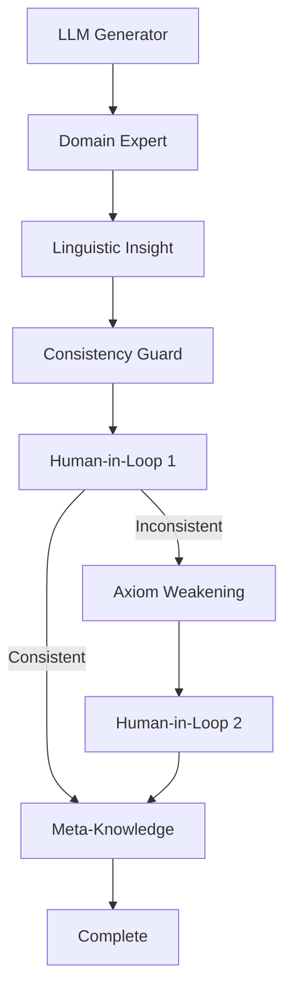

<div align="center">

# 🧠 ADORE

## Agent-Driven Ontology Repair and Evolution

**The Future of Intelligent Knowledge Base Management**

[](https://www.python.org)
[](https://opensource.org/licenses/Apache-2.0)
[](https://github.com/astral-sh/ruff)
[](http://mypy-lang.org/)
[](https://github.com/features/actions)

[Features](#-key-features) • [Quick Start](#-quick-start) • [Documentation](#-documentation) • [Examples](#-examples) • [Contributing](#-contributing)

</div>

---

## 🌟 The Why

Traditional ontology management is a bottleneck. Manual maintenance is slow, error-prone, and doesn't scale. Large Language Models (LLMs) can suggest new knowledge, but they often introduce **inconsistencies** that break formal reasoning.

**ADORE solves this.**

ADORE is a revolutionary framework that orchestrates specialized AI agents to:
- ✅ **Propose** new knowledge using LLMs
- ✅ **Validate** axioms for domain correctness and logical coherence
- ✅ **Detect** inconsistencies automatically
- ✅ **Repair** ontologies through principled axiom weakening
- ✅ **Log** every decision for full explainability (XAI)
- ✅ **Integrate** human oversight at critical decision points (HITL)

> **ADORE transforms ontology evolution from a manual chore into an intelligent, automated, and transparent process.**

---

## 🎯 Key Features

### 🔬 **Research-Backed Framework**
Built on cutting-edge research combining Description Logic reasoning, LLMs, and multi-agent systems. Published methodology ensures trustworthy, reproducible results.

### 🤖 **Multi-Agent Architecture**
Eight specialized agents collaborate seamlessly:
- **LLM Generator**: Proposes new axioms
- **Domain Expert**: Assesses real-world plausibility
- **Linguistic Insight**: Validates syntax
- **Consistency Guard**: Detects logical conflicts
- **Axiom Weakening**: Repairs inconsistencies
- **HITL Stages**: Strategic human checkpoints
- **Meta-Knowledge**: Logs and consolidates results

### ⚡ **Production-Ready Engineering**
- **Lightning-fast** dependency management with `uv`
- **Beautiful CLI** with `Typer` and `Rich`
- **Type-safe** with 100% type hints and `Pydantic V2`
- **Observable** with structured JSON logging
- **Testable** with comprehensive pytest suite
- **Containerized** with multi-stage Docker builds
- **Scalable** async-ready architecture

### 📊 **Full Explainability (XAI)**
Every decision, assessment, and repair is logged in structured JSON format. Audit trails ensure transparency and enable debugging complex knowledge evolution scenarios.

---

## 🚀 Quick Start

### Prerequisites
- Python 3.10+
- [uv](https://github.com/astral-sh/uv) (recommended) or pip
- Java 17+ (for OWL reasoning with HermiT)

### Installation

**Using `uv` (recommended):**
```bash
# Install uv if you haven't
curl -LsSf https://astral.sh/uv/install.sh | sh

# Clone the repository
git clone https://github.com/ruslanmv/Agent-driven-Ontology-Repair-and-Evolution.git
cd Agent-driven-Ontology-Repair-and-Evolution

# Install ADORE
uv pip install -e .
```

**Using pip:**
```bash
pip install -e .
```

### Configuration

Create a `.env` file in the project root:
```bash
# Required
OPENAI_API_KEY=your_openai_api_key_here

# Optional: IBM Watsonx (for alternative LLM backend)
# WATSONX_API_KEY=your_key
# WATSONX_URL=your_url
# PROJECT_ID=your_project_id
```

### Run Your First Cycle

```bash
# Run the Pneumonia example
adore run --ontology examples/data/pneumonia.owl --cycles 1

# Or run the example script
python examples/pneumonia_example.py
```

**Expected Output:**
```
╔═══════════════════════════════════════════════════════════════╗
║                                                               ║
║     █████╗ ██████╗  ██████╗ ██████╗ ███████╗                ║
║    ██╔══██╗██╔══██╗██╔═══██╗██╔══██╗██╔════╝                ║
║    ███████║██║  ██║██║   ██║██████╔╝█████╗                  ║
║    ██╔══██║██║  ██║██║   ██║██╔══██╗██╔══╝                  ║
║    ██║  ██║██████╔╝╚██████╔╝██║  ██║███████╗                ║
║    ╚═╝  ╚═╝╚═════╝  ╚═════╝ ╚═╝  ╚═╝╚══════╝                ║
║                                                               ║
║    Agent-Driven Ontology Repair and Evolution                ║
║                                                               ║
╚═══════════════════════════════════════════════════════════════╝

Configuration:
┌─────────────┬────────────────────────────┐
│ Ontology    │ pneumonia.owl              │
│ Cycles      │ 1                          │
│ Auto HITL   │ ✓                          │
│ JSON Logs   │ ✗                          │
└─────────────┴────────────────────────────┘

✓ Running cycle 1...

Cycle Results:
┌─────────────────────────┬─────────────────────────────────┐
│ Proposed Axiom          │ Pneumonia ⊑ ∃causedBy.NovelVirus│
│ Domain Assessment       │ 0.90 - Medically plausible      │
│ Linguistic Assessment   │ 0.80 - Syntactically coherent   │
│ Consistent              │ ✗                               │
│ Strategy                │ ontology_evolution              │
│ Repairs Applied         │ 1                               │
└─────────────────────────┴─────────────────────────────────┘

✓ All cycles completed successfully! 🎉
```

---

## 📖 Documentation

### CLI Commands

```bash
# Run ontology evolution cycles
adore run --ontology path/to/ontology.owl --cycles 3

# Validate an ontology
adore validate path/to/ontology.owl

# Show version info
adore version

# Get help
adore --help
```

### Programmatic API

```python
from pathlib import Path
from adore import WorkflowState, LLMService, OntologyService, WorkflowOrchestrator

# Initialize services
llm_service = LLMService()
ontology_service = OntologyService()
orchestrator = WorkflowOrchestrator(llm_service, ontology_service)

# Run a cycle
state = WorkflowState(cycle_id=1, ontology_path=Path("my_ontology.owl"))
result = orchestrator.run_cycle(state)

print(f"Strategy: {result.chosen_strategy}")
print(f"Repairs: {len(result.repair_proposals)}")
```

---

## 💡 Examples

### Pneumonia Ontology Evolution

See `examples/pneumonia_example.py` for a complete walkthrough of evolving a medical ontology with ADORE.

**Scenario**: An LLM proposes that "Pneumonia can be caused by NovelVirusX", but this conflicts with existing axioms stating viruses and bacteria are disjoint. ADORE automatically:
1. Detects the inconsistency
2. Proposes a repair by introducing a "Pathogen" bridging concept
3. Weakens specific axioms to more general ones
4. Validates the repair maintains logical consistency

---

## 🏗️ Architecture

ADORE follows **Clean Architecture** principles:

```
src/adore/
├── core/              # Domain models (Pydantic V2)
├── agents/            # Specialized AI agents
├── services/          # Business logic layer
├── infrastructure/    # Logging, config, external deps
├── cli/               # Beautiful Typer CLI
└── utils/             # Shared utilities
```

**Workflow Graph:**


---

## 🧪 Development

### Setup Development Environment

```bash
# Install with dev dependencies
make dev-install

# Run tests
make test

# Run quality checks
make audit

# Format code
make format

# Clean up
make clean
```

### Running Tests

```bash
# Run all tests with coverage
pytest -v --cov=src/adore --cov-report=html

# Run specific test file
pytest tests/test_agents.py -v
```

---

## 🐳 Docker

### Build and Run

```bash
# Build image
make docker-build

# Run container
make docker-run

# Or manually
docker build -t adore:latest .
docker run -it --rm -e OPENAI_API_KEY="${OPENAI_API_KEY}" adore:latest
```

---

## 🤝 Contributing

We welcome contributions! Please see [CONTRIBUTING.md](CONTRIBUTING.md) for guidelines.

### Quick Contribution Guide

1. Fork the repository
2. Create a feature branch (`git checkout -b feature/amazing-feature`)
3. Make your changes
4. Run tests and linting (`make ci`)
5. Commit your changes (`git commit -m 'Add amazing feature'`)
6. Push to the branch (`git push origin feature/amazing-feature`)
7. Open a Pull Request

---

## 📜 Citation

If you use ADORE in your research, please cite:

```bibtex
@article{monti2024adore,
  title={A Design Pattern for Reflective, Agent-Guided Ontology Evolution from LLM-Induced Epistemic Anomalies},
  author={Monti, Marco and Kutz, Oliver and Troquard, Nicolas and Vsevolodovna, Ruslan Idelfonso Magaña},
  journal={arXiv preprint arXiv:XXXX.XXXXX},
  year={2024}
}
```

---

## 📄 License

This project is licensed under the **Apache License 2.0** - see the [LICENSE](LICENSE) file for details.

---

## 👥 Authors

- **Ruslan Magana** - IBM Client Innovation Center Italy
- **Marco Monti** - Free University of Bozen-Bolzano (UNIBZ)

### Research Contributors
- **Oliver Kutz** - Free University of Bozen-Bolzano (UNIBZ)
- **Nicolas Troquard** - Gran Sasso Science Institute (GSSI)

---

## 🌐 Links

- **Repository**: [github.com/ruslanmv/Agent-driven-Ontology-Repair-and-Evolution](https://github.com/ruslanmv/Agent-driven-Ontology-Repair-and-Evolution)
- **Issues**: [Report a bug or request a feature](https://github.com/ruslanmv/Agent-driven-Ontology-Repair-and-Evolution/issues)
- **Discussions**: [Join the conversation](https://github.com/ruslanmv/Agent-driven-Ontology-Repair-and-Evolution/discussions)

---

## ⭐ Star History

If you find ADORE useful, please consider giving it a star! ⭐

[](https://star-history.com/#ruslanmv/Agent-driven-Ontology-Repair-and-Evolution&Date)

---

<div align="center">

**Built with ❤️ for the AI and Semantic Web communities**

[⬆ Back to Top](#-adore)

</div>
