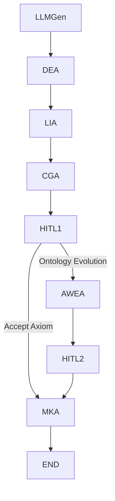

# ADORE: Agent-Driven Ontology Repair and Evolution

This repository contains a demo implementation for the research paper:

**"A Design Pattern for Reflective, Agent-Guided Ontology Evolution from LLM-Induced Epistemic Anomalies"**
*Marco Monti, Oliver Kutz, Nicolas Troquard and Ruslan Idelfonso Magaña Vsevolodovna*
*Free University of Bozen-Bolzano (UNIBZ), IBM, Gran Sasso Science Institute (GSSI), IBM Client Innovation Center Italy*

## Abstract

The integration of Large Language Models (LLMs) with formal ontologies presents a significant opportunity for knowledge base enrichment, yet concurrently introduces substantial challenges in maintaining logical consistency and trustworthiness. Current approaches often struggle with the semantic richness versus logical rigor dichotomy, or lack transparent mechanisms for resolving LLM-induced inconsistencies. This position paper introduces **ADORE (Agent-driven Ontology Repair and Evolution)**, a novel conceptual framework designed to address these challenges. We posit that a principled approach to LLM-ontology co-evolution requires a synergistic combination of: (1) treating inconsistencies not as mere errors but as triggers for principled ontology evolution; (2) employing formal axiom weakening as a primary, information-preserving repair mechanism; (3) orchestrating the process through a multi-agent system (MAS) that delineates specialized roles; and (4) embedding Human-in-the-Loop (HITL) oversight and comprehensive explainability (XAI) via systematic meta-knowledge logging. We argue that ADORE offers a more robust, transparent, and adaptable paradigm for evolving formal knowledge bases in collaboration with LLMs, paving the way for more trustworthy and semantically coherent neurosymbolic AI systems. We outline the core components of ADORE, illustrate its conceptual feasibility through scenarios, and discuss its potential to foster a new generation of dynamic knowledge co-evolution systems.

## Keywords

Ontology Evolution, Ontology Repair, Axiom Weakening, Large Language Models (LLMs), LLM-induced Inconsistencies, Epistemic Anomalies, Agentic AI, Multi-Agent Systems (MAS), Human-in-the-Loop (HITL), Explainable AI (XAI), Description Logic Reasoning, Hybrid Knowledge Architectures, Ontology Design Patterns, Semantic Richness, Knowledge Co-evolution.

-----

## What Does ADORE Stand For?

  * **A**gent-**D**riven: Specialized AI agents collaborate to deliberate and generate ontology repair proposals.
  * **O**ntology **R**epair: Handles logical inconsistencies using formal axiom weakening, guided by agent deliberation and human oversight.
  * **O**ntology **E**volution: Allows ontologies to adapt semantically over time, especially in response to novel or emerging concepts identified through inconsistencies.

-----

## Notebook Overview: `ADORE_Demo.ipynb`

This Jupyter Notebook provides a practical demonstration of the ADORE framework. It showcases a single cycle of the ADORE process, illustrating how an LLM-proposed axiom is assessed, checked for consistency, and potentially repaired or integrated into a foundational "Pneumonia" ontology.

### Program Workflow: Axiom Discovery and Ontology Evolution (ADORE)

The ADORE program operates as a sophisticated, multi-step process designed to intelligently propose, evaluate, and integrate new knowledge (axioms) into an existing **ontology** (a structured representation of knowledge). Imagine it as a team of experts collaborating to refine a medical encyclopedia.

Here's a simplified flow:

1.  **Environment Setup and Ontology Initialization:** First, the program gets ready by importing all the necessary tools (like **Owlready2** for handling the ontology and **LangGraph** for managing the workflow). It then loads or creates a starting ontology, which in this case, is a basic **Pneumonia ontology** containing initial facts about the disease. This also includes setting up a mock system to use OpenAI's powerful language models, acting as a stand-in for other AI services.

2.  **Axiom Proposal (LLM Generator):** An **AI (Large Language Model) agent** steps in, acting as a creative thinker. It analyzes the current ontology and proposes a *new axiom* – a single, formal statement of knowledge – in a specific logical format. For example, it might suggest that "Pneumonia can be caused by NovelVirusX."

3.  **Axiom Assessment (Domain Expert & Linguistic Insight Agents):** The proposed axiom then goes through a review process by two specialized agents:

      * The **Domain Expert Agent** evaluates the axiom's **medical plausibility** (e.g., "Does it make sense from a medical perspective?").
      * The **Linguistic Insight Agent** checks its **syntactic correctness** and logical structure (e.g., "Is it written in the correct logical language?").

4.  **Consistency Check (Consistency Guard Agent):** Next, a crucial step: the **Consistency Guard Agent** takes the proposed axiom and temporarily adds it to a *copy* of the current ontology. It then runs a **reasoner** (a tool that checks for logical contradictions). If the new axiom creates a contradiction with existing knowledge in the ontology, it's flagged as inconsistent.

5.  **Human Decision Stage 1 (HITL Stage 1):** A **Human-in-the-Loop (HITL)** agent steps in to make a strategic decision. If the proposed axiom is consistent, the human (simulated here) might choose to "Accept Axiom" (though the actual addition happens later). If it's *inconsistent*, the human decides on "Ontology Evolution," indicating that a repair process is needed.

6.  **Axiom Weakening/Repair (Axiom Weakening Agent):** If an inconsistency was detected, the **Axiom Weakening Agent** attempts to fix it. This involves modifying or "weakening" existing axioms in the ontology or even the proposed axiom itself to resolve the contradiction while trying to retain as much useful information as possible. It proposes a "repaired" version of the ontology.

7.  **Human Decision Stage 2 (HITL Stage 2):** Another **Human-in-the-Loop** stage occurs. If a repair proposal was made, the human (simulated) reviews it and decides whether to accept the repaired ontology as the new, updated knowledge base.

8.  **Knowledge Consolidation & Logging (Meta-Knowledge Agent):** Finally, the **Meta-Knowledge Agent** takes the chosen, consistent version of the ontology (either the one with the accepted axiom or the repaired one) and makes it the *new active ontology*. It also meticulously records all the steps and decisions made during this cycle, creating a detailed log of the knowledge evolution process.

This entire cycle is designed to allow the system to continuously learn and expand its knowledge base in a logically sound and human-supervised manner.

### ADORE Workflow Diagram

The following Mermaid diagram provides a visual representation of the ADORE system's flow, illustrating how each agent interacts in this iterative process of knowledge management.



This graph showcases the dynamic interplay between the various components:

  * **LLMGen (LLM Generator Agent)**: The **starting point** of the workflow, where the AI proposes new axioms to expand the ontology's knowledge.
  * **DEA (Domain Expert Agent)**: Evaluates the **real-world plausibility** of the proposed axiom, mimicking a subject-matter expert's judgment.
  * **LIA (Linguistic Insight Agent)**: Assesses the **formal correctness and syntactic coherence** of the axiom in Description Logic.
  * **CGA (Consistency Guard Agent)**: A **critical checkpoint** that verifies the axiom's compatibility with the existing ontology, flagging any logical inconsistencies.
  * **HITL1 (Human-in-the-Loop Stage 1)**: The **initial human decision point**, determining whether to proceed with ontology evolution (repair) if inconsistencies are found or to accept the axiom if it's consistent.
  * **AWEA (Axiom Weakening Agent)**: Engages when inconsistencies are detected, **proposing modifications** to resolve contradictions and restore logical soundness.
  * **HITL2 (Human-in-the-Loop Stage 2)**: The **secondary human review**, where proposed repairs from AWEA are evaluated and chosen for integration.
  * **MKA (Meta-Knowledge Agent)**: The **final consolidation stage**, responsible for updating the active ontology with accepted changes and logging the entire cycle for future reference.
  * **END**: Signifies the **completion of one ADORE cycle**, leaving the ontology updated and ready for continuous refinement.

This structured workflow ensures that any new knowledge introduced into the ontology is rigorously vetted for domain relevance, linguistic correctness, and logical consistency, with strategic human checkpoints to guide the automated processes.

-----

## Setup and Installation

To run this notebook, you will need to set up your Python environment and provide API keys for the Large Language Models.

### Prerequisites

  * Python 3.9+
  * Jupyter Notebook or JupyterLab

### Installation Steps

1.  **Clone the repository:**

    ```bash
    git clone https://github.com/ruslanmv/ADORE-framework.git
    cd ADORE-framework
    ```

    (Replace `ruslanmv/ADORE-framework.git` with the actual repository URL)

2.  **Create a virtual environment (recommended):**

    ```bash
    python -m venv venv
    source venv/bin/activate  # On Windows: `venv\Scripts\activate`
    ```

3.  **Install dependencies:**

    ```bash
    pip install -r requirements.txt
    ```

    A `requirements.txt` file should contain the necessary libraries:

    ```
    owlready2
    langgraph
    langchain
    langchain-openai
    python-dotenv
    ```

4.  **API Key Configuration:**
    This demo uses OpenAI's models . You need an OpenAI API key.

      * **Local Environment:** Create a `.env` file in the root directory of your project and add your OpenAI API key:

        ```
        OPENAI_API_KEY_PERSONAL="your_openai_api_key_here"
        ```

        (Note: The code also includes placeholders for Watsonx API keys; these are not strictly necessary for the demo to run as OpenAI is used as a mock).

      * **Google Colab:** If running in Google Colab, use the `userdata` feature:

        ```python
        from google.colab import userdata
        # In a code cell, set your key:
        # userdata.set("OPENAI_API_KEY_PERSONAL", "your_openai_api_key_here")
        # The notebook will then retrieve it using userdata.get()
        ```

### Running the Notebook

1.  Start Jupyter Notebook or JupyterLab:

    ```bash
    jupyter notebook
    ```

    or

    ```bash
    jupyter lab
    ```

2.  Open the `ADORE_pipeline.ipynb` notebook.

3.  Execute the cells sequentially to observe the ADORE workflow in action.

## Contributing

We welcome contributions to this project. Please feel free to open issues or submit pull requests.

## Citation

If you use this code or framework in your research, please cite our paper:

```bibtex
@article{monti2024adore,
  title={A Design Pattern for Reflective, Agent-Guided Ontology Evolution from LLM-Induced Epistemic Anomalies},
  author={Monti, Marco and Kutz, Oliver and Troquard, Nicolas and Vsevolodovna, Ruslan Idelfonso Magaña},
  journal={arXiv preprint arXiv:XXXX.XXXXX}, % Replace with actual arXiv ID or publication details
  year={2024}
}
```


## License

This project is licensed under the MIT License - see the [LICENSE](https://www.google.com/search?q=LICENSE) file for details.